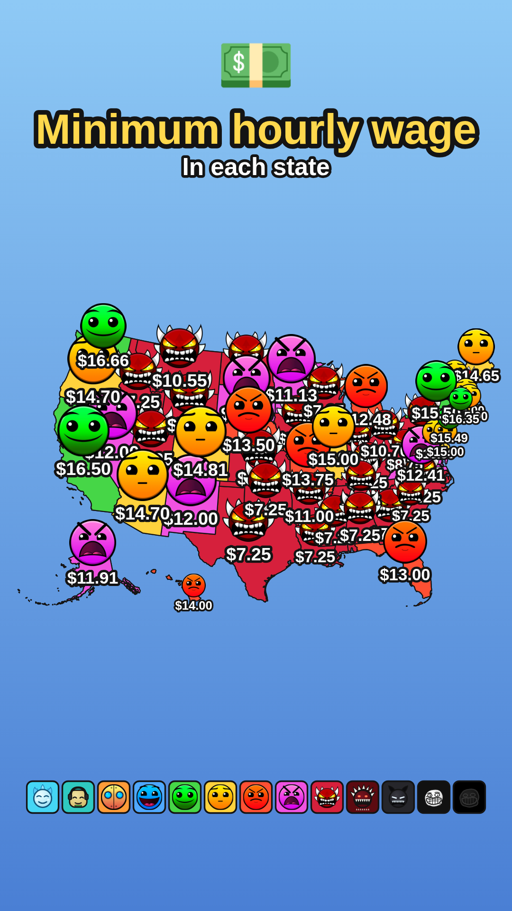
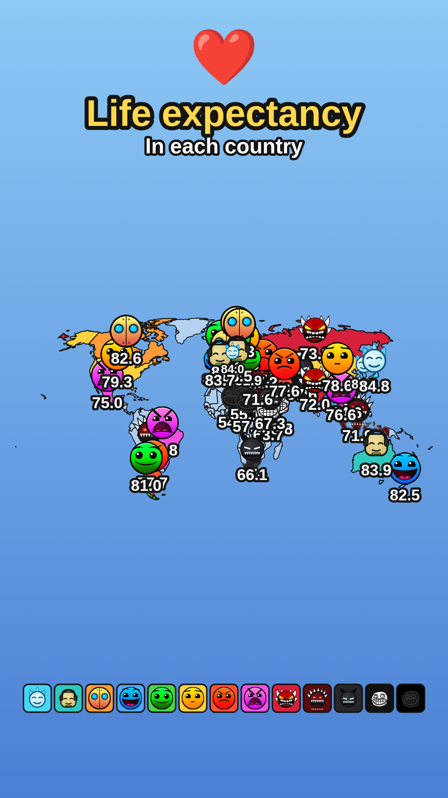

# GD Stat Maps

Recreate those Instagram "stats rated with Geometry Dash difficulties" maps.
Paste in a stat for each country or US state, and the app rates every region
on the GD difficulty scale, fills it in with the matching color and face, and
plays the classic one-region-at-a-time reveal. Export a PNG or record a WebM
video ready to post.

| US states | World countries |
| --- | --- |
|  |  |

## Run it

It's a static page — no build step. From the repo root:

```sh
python3 -m http.server 8000
# then open http://localhost:8000
```

(or `npx serve`, or any other static file server. Opening `index.html` directly
from disk won't work because the map data is fetched at runtime.)

## Using it

1. **Pick a map** — United States (states) or World (countries).
2. **Paste your data**, one region per line:

   ```
   Texas, 7.25
   Washington, 16.66
   California, 16.50
   ```

   - Separators: comma, semicolon, or tab. Lines starting with `#` are ignored.
   - Names are matched loosely: `TX`, `USA`, `UK`, `South Korea`, `Ivory Coast`,
     etc. all work. Anything that doesn't match is listed under the box.
   - An optional 3rd column pins a region to a specific tier, by name or 1-based
     number: `Ohio, 10.70, troll` or `Ohio, 10.70, 12`.

3. **Choose the rating scale**:
   - **IG meme scale (13 tiers)** — Goated (icy face) → Chill (headphones) →
     Auto → Easy → Normal → Hard → Harder → Insane → Demon → Silent (Clubstep
     monster) → Nightmare → Troll → Unrankable. This is the scale the IG stat
     pages use.
   - **Classic GD (11 tiers)** — Auto → Easy → Normal → Hard → Harder → Insane
     → Easy/Medium/Hard/Insane/Extreme Demon.
4. **Tune the rating**:
   - *Higher value = better* flips which end of your data gets the happy faces.
   - *Tier split*: **Ranked** spreads the distinct values evenly across the
     tiers (ties like fifty `$7.25` states share one tier); **Linear** buckets
     by the raw value range.
   - *Best/Worst tier used* limits the scale to a contiguous range — e.g.
     Normal → Demon keeps the troll tiers out of an ordinary post.
5. **Style the card** — title, subtitle, emoji, label prefix/suffix (e.g. `$`),
   canvas size (story / square / landscape), background, icon & label size.
6. **Animate & export**:
   - **Play reveal** fills the regions in one by one (worst→best, best→worst,
     data order, or alphabetical) with a pop-in on each face.
   - **Export PNG** saves the finished map.
   - **Record video (WebM)** captures the whole reveal to a downloadable video.
     Keep the tab focused while it records. To convert for Instagram:
     `ffmpeg -i gd-stat-map.webm -c:v libx264 -pix_fmt yuv420p gd-stat-map.mp4`

## Icons

The official difficulty faces in `icons/` (auto, easy, normal, hard, harder,
insane, and the demons) are Geometry Dash game assets by RobTop Games,
obtained from the public [GDBrowser](https://github.com/GDColon/GDBrowser)
repository. They're included for personal, non-commercial fan content —
the same way the IG stat pages use them.

The custom meme tiers (Goated, Chill, Silent, Nightmare, Troll, Unrankable)
ship as built-in look-alike SVG art. To use the exact icons from the IG
legend instead, drop PNGs into `icons/` with these names and they're picked
up automatically:

```
icons/goated.png  icons/chill.png  icons/silent.png
icons/nightmare.png  icons/troll.png  icons/unrankable.png
```

(Any tier can be overridden the same way — the app prefers `icons/<key>.png`
over the built-in art. Square-ish images with transparent backgrounds look
best.)

## Map data

- World: [world-atlas](https://github.com/topojson/world-atlas) 1:110m
  (Natural Earth)
- US states: [us-atlas](https://github.com/topojson/us-atlas) (US Census
  Bureau), Albers composite projection with Alaska & Hawaii insets
- Rendering: [D3](https://d3js.org) + topojson-client, bundled in `vendor/`

## Repo layout

```
index.html        the app (open via a local server)
js/app.js         rendering, tiering, animation, export
js/gd-icons.js    tier definitions + fallback SVG faces
js/names.js       region name normalization & aliases
icons/            difficulty face images
data/             TopoJSON map data
vendor/           d3 + topojson-client
```
